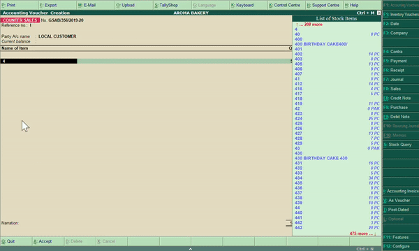

# Tally-ERP-Automation
Extracts the daily sales report from a CSV file and creates a sale voucher automatically in Tally ERP using PyAutoGUI. A task that would usually take around 25 - 30 minutes is now done in almost 2 minutes with no error. Python Power 💪🏻 :P

## Usage Guide
1. Install the necessary packages from requirements.txt
2. Run Step 1.py
    * It takes the daily sales report and extracts the unique item identifier and its corresponding quanity.
3. Run Step 2.py
    * Enters all the extracted data into Tally

## Script in Action

## Ackowledgment
[Automate the Boring Stuff with Python]([https://automatetheboringstuff.com/](https://automatetheboringstuff.com/))
